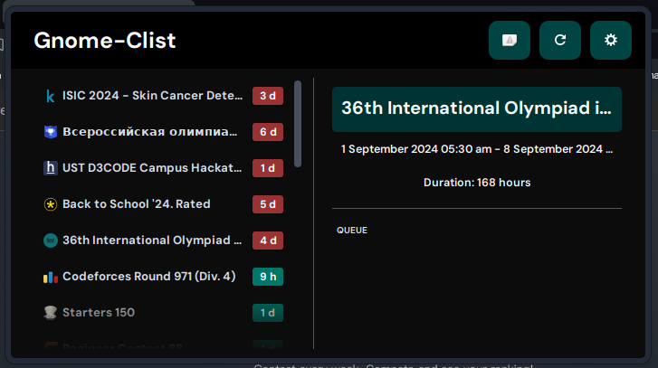

# Gnome-Clist 🏅



Gnome-Desktop Extension for Clist API. This is a Sport programming companion, which brings the list of upcoming public contests right on your desktop. This extension is based-off of [Clist API](https://clist.by/api/v4/doc) and therefore provides a list of a bunch of contests from all over the web.

> More features on the way in further releases
>
> - Queuing System
> - Custom Settings
> - Selection scripts

## Installation

> You need Gnome Desktop Manager (GDM) as your Desktop Manager to use this.

1. Clone the repository to `/home/{user}/.local/share/gnome-shell/extensions` folder.
```bash
git clone https://github.com/developer-kush/Gnome-Clist.git
```

2. Rename the `Gnome-Clist` folder to `cplist@kushagra.agarwal.2709@gmail.com`

3. Restart your system 

4. Open terminal and run 
```bash
gnome-extensions enable cplist@kushagra.agarwal.2709@gmail.com
```

